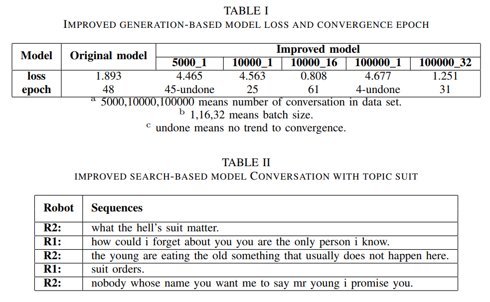

# Question and Answer Chatbot

Explored chat between chatbots about a given topic in the training set corpus. Trained an AI program-based chatbot that can talk to itself using TensorFlow, used Seq2Seq model for training, and optimized the model using a hierarchical neural network.

## Requirements

python version 3.5

numpy version 1.17.3

tensorflow version 0.9.0

## Getting Started

Run aivsai.py to train the model.

```
python aivsai.py
```

Run test.py to view the result of the model.

```
python test.py
```

## Results

